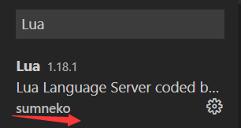
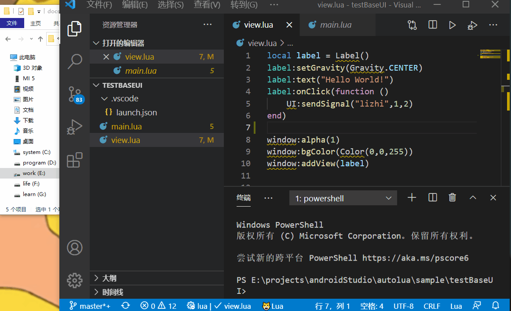

# 代码自动提示，补全
通过一些设置，可以在VSCode这个软件上面达到代码提示，自动补全等效果，加快我们开发的速度
## 前提条件
1. 必备软件VSCode
2. 必备VSCode插件Lua Language Server
3. 需要从本项目中下载两个文件夹  
[AutoLuaAPI](../api)  
[陌陌开源的前端框架API](../MomoKit)
## 步骤
1. VSCode的软件安装请自行百度
2. 如何在VSCode中安装插件也不再赘述了，自行百度，需要注意的是插件不要安装错了
3. 把下载下来的两个文件夹路径设置到插件中  
  
如果没有效果的话就重启一下VSCode试试  

