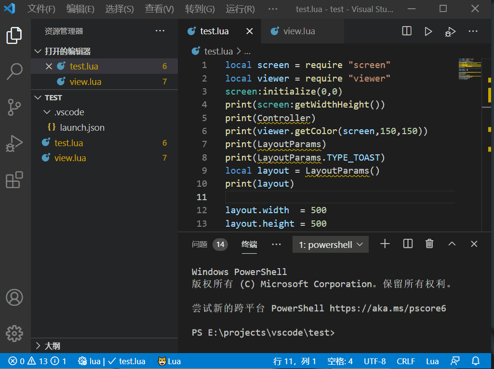
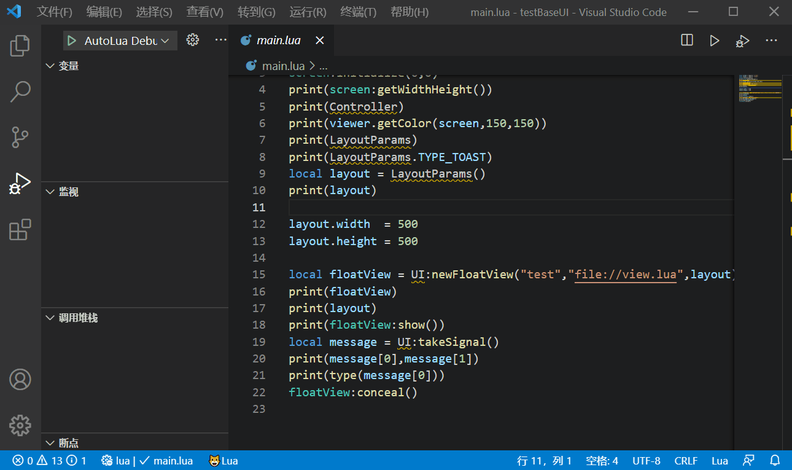

# 如何快速使用AutoLua

## 前提条件
1. 首先你需要熟悉lua语言的语法
2. 你需要一部android5.0以上并且root的手机
3. 目前来说你需要一部电脑
4. 你的开发环境必须有局域网

## 步骤
以下提到的手机代表是 android5.0以上版本root的手机  
1. 你的手机需要安装**AutoLua**的客户端，[下载地址](https://www.lizhistudio.top/android/autolua.apk)
2. 确保你的手机与电脑连接在同一局域网下  

3. 你的电脑需要安装VSCode软件
4. 你的VSCode软件需要安装AutoLuaDebugger插件,在插件商店搜索安装即可
5. 配置AutoLuaDebugger插件ip地址，端口等，注意这里的设置必须与手机的一致  

6. VSCode新建一个项目，根据[API](../api/README.md)写一些脚本，或者直接在[例子](../../sample)中下载一个到电脑中，并且用VScode打开
7. VSCode开始调试
  
这里使用的例子是[testBaseUI](../../sample/testBaseUI)此时手机开始的状态是  
  
点击hello world 就会消失，具体流程请查看源码  
同时请注意，项目中也会出现相应的项目，你可以点击启动在手机上直接运行
